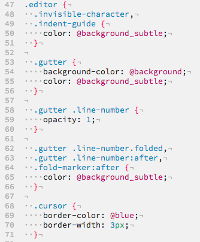

# pencil-light theme

Really like [iA Writer's][iaw] colors, but want them elsewhere?  This is a port to Atom, based on the [vim theme][pencil-vim].  It's a quick and dirty port so far while kicking the tires on atom, here's the [dark version][atom-pencil-dark].

If you'd like a companion theme for your iTerm, check out my [iTerm theme][pencil-iterm].

[iaw]: http://www.iawriter.com/
[pencil-vim]: https://github.com/reedes/vim-colors-pencil
[pencil-iterm]: https://github.com/mattly/iterm-colors-pencil
[atom-pencil-dark]: https://atom.io/packages/pencil-dark
